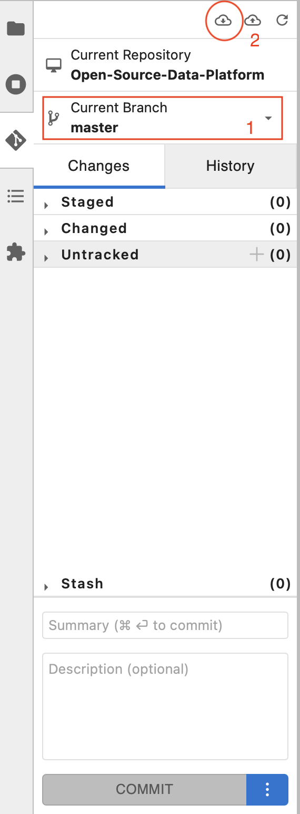
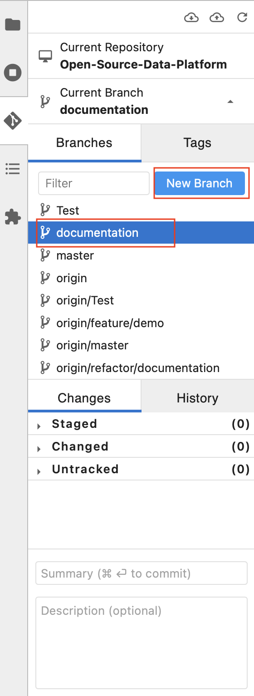
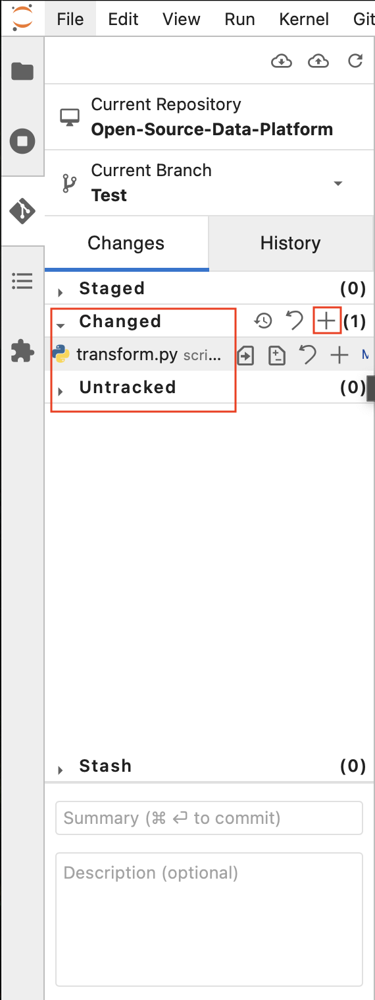
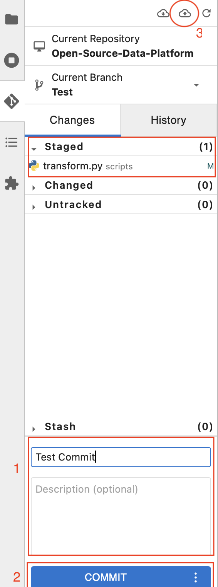

# Git & GitHub Team-Workflow Dokumentation

Diese Dokumentation beschreibt den empfohlenen Ablauf für die Zusammenarbeit in Teams mit Git und GitHub. Ziel ist ein klarer, nachvollziehbarer und konfliktfreier Entwicklungsprozess.

---

## Repository-Struktur

- **`master` oder `main`**: Hauptbranch, immer stabil und produktionsbereit.
- **Feature-Branches**: Jeder arbeitet in eigenen Branches (z. B. `feature/login`, `bugfix/api-error`).

---

## Aufsetzen

- Repository aufsetzen mit:
- clone Link
- Acces Token
- Username

---

## Standard-Workflow für Teammitglieder

### 1. Lokalen `master` aktualisieren
Vor jeder Änderung sicherstellen, dass du den neuesten Stand hast:

- Master branch auswählen
- Änderungen pullen

### 2. Neuen Branch erstellen/wechseln

- In Branch wechseln
- Oder mit blauer Schaltfläche neuen erstellen

### 3. Änderungen vornehmen

- Changed: Zeigt veränderte Dateien
- Untracked: Zeigt neue Dateien
- Änderungen mit "+" übernehmen

### 4. Committen & Branch pushen

- Staged: Zeigt übernommene Veränderungen (können auch wieder rausgenommen werden)
- Commit Nachricht schreiben!
- Commit Schaltfläche drücken
- Pushen

### 5. Pull Request (PR) stellen

- Auf GitHub im Projekt-Repo
- "Compare & Pull Request" klicken
- Ziel: `base = master`, `compare = dein branch` (WICHTIG!)
- Titel & Beschreibung eingeben (z. B. "Bitte prüfen und mergen")

---

## Workflow für Maintainer

### 1. PR auf GitHub prüfen
- **Code-Diff anschauen**
- Feedback geben oder direkt freigeben

### 2. Merge durchführen

- Button: **"Merge pull request"** klicken
- Merge-Strategie auswählen:
  - Merge Commit (Standard)
  - Squash & Merge (alle Commits zusammenfassen)
  - Rebase & Merge (Chronologie erhalten)

### 3. Optional: Branch löschen

GitHub bietet an, den Quellbranch nach dem Merge zu löschen.

---

## Branch-Schutz (empfohlen)
Maintainer können Schutzregeln aktivieren (GitHub > Settings > Branches):

- Direkte Pushes auf `master` verbieten
- PRs müssen Reviews durchlaufen
- Tests/Checks müssen erfolgreich sein

---

## Konventionen & Best Practices

### Branch-Namen
| Typ        | Beispiel                  |
|------------|---------------------------|
| Feature    | `feature/login`           |
| Bugfix     | `bugfix/fehler-500`       |
| Refactor   | `refactor/user-model`     |
| Test       | `test/test-db-fallback`   |

### Commit-Messages
- Klar, prägnant, englisch oder deutsch einheitlich
- Format: `[Typ] Kurzbeschreibung`
  - Beispiele:
    - `[Fix] Verhindere Absturz bei leeren Eingaben`
    - `[Feature] Neue Ansicht für Benutzerdaten`

---

## Nützliche Git-Kommandos

| Zweck                      | Befehl                                  |
|----------------------------|------------------------------------------|
| Neuesten Stand holen       | `git pull origin master`                |
| Neuen Branch starten       | `git checkout -b feature/xyz`           |
| Commit erstellen           | `git commit -m "Message"`               |
| Push zum Remote            | `git push origin mein-branch`           |
| Branch löschen (lokal)     | `git branch -d mein-branch`             |
| Branch löschen (remote)    | `git push origin --delete mein-branch`  |
| Branch anzeigen (lokal)    | `git branch`                            |
| Branch anzeigen (remote)   | `git branch -r`                         |
| Branch aktualisieren       | `git fetch`                             |

---

> „Commit often. Push when ready. Review with care. Merge with confidence.“